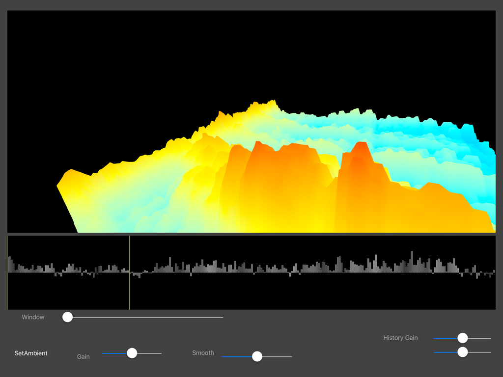

# FFT
realtime FFT of audio input, for iPad using Swift and Metal

Based on FFT and Audio Input code written by John Scalo \
https://github.com/jscalo/tempi-fft

Realtime audio input is run through an FFT, and the data is cycled\
through a 3D terrain as height map slices.\
Makes for an interesting display of your singing voice.

